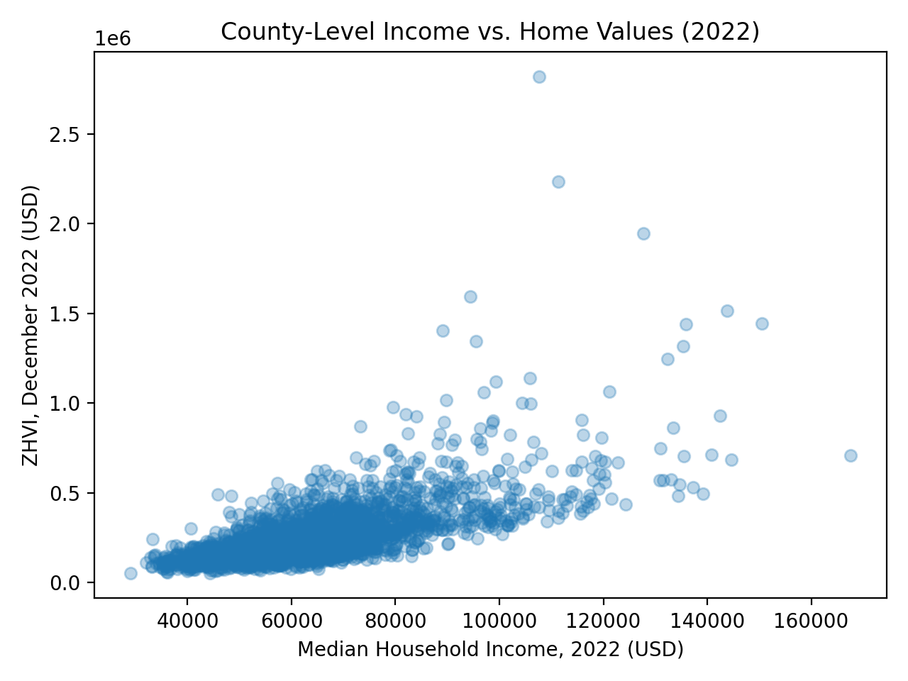

# Income and Home Value Relationships Across U.S. Counties (2022)

## Contributors
- **Arnav Theppasandra** 
- **Yajat Negi** 


## Summary

The goal of this project is to look at how median household income relates to median home values across counties in the United States. Housing affordability and income inequality are major policy concerns in recent years as home prices have risen faster than incomes in many regions. Understanding how income levels correlate with home values at the county level can help understand  socioeconomic patterns, regional differences, and potential barriers to housing access. Our project focuses on the relationship between county-level median household income—sourced from the USDA Economic Research Service—and the Zillow Home Value Index (ZHVI), which estimates typical single-family home values. By integrating these two datasets, we provide an analysis that shows national trends across more than 3,000 U.S. counties.

Our motivation comes from an interest in how economic factors shape local housing markets. National media and academic research highlight affordability crises, but many analyses focus either on large areas that dont show local variation. County-level data allows for a more fine-grained view as some rural counties have low home prices but also low incomes, while certain coastal counties have extremely high home values relative to income. By pairing ZHVI data with income data from the USDA, our project enables a systematic exploration of how strong the income–housing relationship is, and whether this relationship appears stable or varies widely across different types of communities.

We structured our research around two core questions:  
1. **Do counties with higher median household incomes tend to have higher home values?**  
2. **What is the strength of the statistical relationship between income and home prices?**

To answer these questions, we curated, cleaned, and integrated county-level datasets for 2022. Integrating the data required matching county identifiers, cleaning missing records, ensuring consistent formats, and aggregating Zillow’s monthly ZHVI values into yearly medians. The integrated dataset ultimately contained 3,052 counties for which both income and home value data were available.

Our analytical approach uses descriptive statistics, correlation analysis, and a simple linear regression model to examine how income relates to home prices. Summary statistics reveal substantial variation: county median incomes range from below $30,000 to above $160,000, while home values vary from approximately $50,000 to more than $2.8 million. Despite this wide range, the correlation between income and home values is moderately strong (Pearson r ≈ 0.68), suggesting that as county income increases, home prices tend to increase as well. The regression results reinforce this pattern: home values rise by approximately $6,780 for every $1,000 increase in county median income. This aligns with broader economic theory linking income levels to demand for housing and willingness to pay.

The visualizations generated in this project illustrate a clear upward trend, though with notable dispersion. High-income counties tend to cluster toward higher ZHVI values, while low-income counties cluster around lower home values. Yet the scatter also reveals heterogeneity as some counties deviate from the trend due to unique local factors, such as tourism-driven housing markets, low supply, or regional economic shocks.

This project provides a fully reproducible pipeline from raw data to final results implemented using Python, Pandas, NumPy, Matplotlib, and Snakemake for workflow automation. All code, outputs, and figures are stored in structured directories and generated using automated scripts. Any user following the documented reproduction instructions can regenerate our results exactly.

Our findings support the hypothesis that higher-income counties tend to have higher home values, with a strong but not perfect relationship. The project highlights the importance of clean data integration and reproducible workflows in data-driven social science, while offering insights into the structural links between income and housing prices across the United States.


## Data Profile

This project relies on two primary datasets sourced from well-established and trustworthy government and research institutions: Zillow Home Value Index (ZHVI) county-level dataset, and USDA Economic Research Service (ERS) median household income dataset. Both datasets offer extensive national coverage and are widely used in policy research, academic studies, and economic analyses. This section describes each dataset in detail, including its structure, variables, provenance, access method, and ethical or legal considerations relevant to its use within this project.

### 1. Zillow Home Value Index (ZHVI)

The first dataset is the Zillow Home Value Index (ZHVI), provided through the Zillow Research Data Portal. ZHVI is a smoothed, seasonally adjusted estimate of the typical home value in a given geographic area. Zillow computes this index using a proprietary automated valuation model (AVM) that incorporates transaction data, listing information, machine learning models, and housing characteristics. Although the internal methodologies are not fully disclosed, ZHVI is widely recognized as one of the most reliable and consistently updated indicators of U.S. home values.

The ZHVI dataset used in this project is the **County Time Series**, which provides monthly estimates of typical home values for over 3,000 counties and county-equivalent units across the United States. The dataset is accessed in CSV format and contains columns such as:

- **RegionID**: A Zillow-specific identifier for the county.  
- **RegionName**: County name.  
- **StateName**: Full state name.  
- **State**: State abbreviation.  
- **CountyName**: Standard county name field.  
- **Date columns**: Monthly ZHVI values (e.g., `2022-01-31`, `2022-02-28`, …).

Because the raw dataset spans many years and contains monthly data, preprocessing is required before analysis. For this project, we converted the 2022 monthly estimates into a single annual median value (`ZHVI_2022`). This aggregation ensures comparability with the USDA income dataset, which is annual rather than monthly. While the dataset is large, it is well-structured, clearly organized, and consistent in formatting.

**Ethical and licensing considerations:**  
Zillow provides ZHVI data free for academic and research purposes, but it remains proprietary. It must be acknowledged that Zillow Research is the data provider, and redistribution of raw data may be restricted depending on context. 

---

### 2. USDA Economic Research Service (ERS) — Median Household Income

The second dataset comes from the U.S. Department of Agriculture’s Economic Research Service (ERS). The **County-Level Data Sets** collection includes a variety of socioeconomic indicators for all U.S. counties, including unemployment rates, poverty estimates, population growth, and educational attainment. For this project, we extracted only the **median household income** variable for 2022.

The dataset is provided in CSV format and includes the following important fields:

- **FIPS**: A standardized county identifier used across all federal datasets.  
- **County Name**  
- **State Name**  
- **Median_Household_Income_2022**  

The USDA dataset is one of the most authoritative and widely used sources for income statistics. Data is compiled using the American Community Survey (ACS) 5-year estimates, ensuring that even small counties have reliable income values. The dataset is updated annually and undergoes extensive review to ensure accuracy.

**Ethical and licensing considerations:**  
USDA data is public domain because it is produced by the U.S. federal government. There are no restrictions on using, redistributing, or modifying the data. However, proper citation is still required for transparency and academic integrity. Because the dataset contains only aggregated county-level statistics, there are no privacy or confidentiality concerns and no individually identifiable information.

---

### 3. Suitability of Datasets for This Project

These two datasets complement each other extremely well:

- Both offer **nationwide, county-level coverage**.  
- Both include stable, consistent identifiers that enable integration (ZHVI county names vs. USDA FIPS codes, reconciled during cleaning).  
- Both represent socioeconomic indicators relevant to housing market analysis.  
- Both come from **high-trust sources** widely used in academic and industry research.

The Zillow dataset provides the dependent variable (home values), while the USDA dataset provides the independent variable (income). Together, they allow an analysis of how economic status relates to housing affordability.

---

### 4. Data Format, Structure, and Challenges

Although both datasets are high quality, integration required addressing several issues:

- **Non-matching county identifiers:** Zillow uses county names while USDA uses FIPS codes. Standardization was required.  
- **Monthly vs. annual frequency:** Zillow data had to be aggregated to match the USDA’s annual format.  
- **Missing counties:** Some small or island counties lacked data in one or both datasets and were removed.  
- **Large file size:** Zillow’s dataset includes multi-year data requiring filtering for 2022 only.

These challenges were resolved during the cleaning stage and documented for reproducibility.

---

Together, the ZHVI and USDA datasets form a strong foundation for investigating the relationship between income and home values across the United States.

## Data Quality

Ensuring high data quality is a core component of any data-driven research project, and it is especially important when integrating two independent datasets collected by different organizations using different methodologies. For this project, we conducted a data quality assessment focusing on completeness, consistency, accuracy, validity, and suitability for analysis. This section goes over our evaluation of both the Zillow Home Value Index (ZHVI) dataset and the USDA Economic Research Service (ERS) median household income dataset, as well as the steps taken to resolve issues discovered during data cleaning and integration.

### 1. Completeness and Coverage

The Zillow ZHVI dataset includes more than 3,000 U.S. counties, providing nearly full national coverage. However, a small number of counties—typically extremely rural areas, island territories, or county-equivalent jurisdictions—do not have ZHVI estimates. This is expected because Zillow’s valuation models rely on housing market activity, and some counties have extremely few annual transactions. Missing ZHVI values were identified during preprocessing, and affected counties were removed to prevent distortions.

The USDA income dataset also includes nationwide coverage, listing median household income for nearly all counties in the United States. Because the dataset is derived from the American Community Survey (ACS), which is statistically imputed for small populations, coverage is highly consistent. The dataset contained a complete set of FIPS-coded counties for 2022, allowing for robust integration. After alignment with Zillow’s data, the final merged dataset contained 3,052 valid county records, representing nearly all counties in the nation.

### 2. Consistency and Standardization

Consistency issues typically arise when two datasets represent the same geographic or conceptual entity using different identifiers or naming conventions. In this project, Zillow identifies counties primarily through the `RegionName` and `StateName` fields, while the USDA dataset uses standardized FIPS codes combining state and county identifiers. Because FIPS codes are the most reliable federal standard, the first step was to validate and standardize county names and states to correctly map Zillow entries to their corresponding FIPS codes.

This involved fixing minor naming mismatches, such as:

- “St. Louis City” vs. “Saint Louis (city)”
- “Doña Ana County” vs. “Dona Ana County” (accent variations)
- “Roanoke City” vs. “Roanoke”

These inconsistencies are typical in county-level datasets. We used a combination of standardization and manual inspection to ensure all matching pairs were correctly identified. Counties that could not be mapped confidently were excluded.

### 3. Accuracy and Reliability

Both datasets originate from reputable organizations, but their accuracy relies on different underlying mechanisms:

- **Zillow ZHVI** uses automated valuation models that synthesize observed market transactions, property characteristics, and machine learning predictions. While AVMs are widely used, they are not perfect. Areas with low transaction frequency may produce noisier estimates. To limit this, Zillow’s ZHVI is smoothed and seasonally adjusted, reducing volatility and improving reliability.
  
- **USDA median income** data is derived from ACS 5-year estimates, which combine survey data with statistical modeling to produce stable indicators for small geographic areas. While ACS margins of error exist, particularly for sparsely populated counties, the dataset is federally standardized and widely trusted.

Because both datasets aggregate values at the county level, data—privacy risks are nonexistent and the values represent broad economic conditions rather than granular personal information.

### 4. Validity and Reasonableness Checks

To evaluate whether the datasets behaved as expected, we conducted exploratory checks on distributions, outliers, and ranges.

For ZHVI:
- Home values ranged from about **$50,000** to **$2.8 million**, which is reasonable given the diversity of U.S. housing markets.
- Distribution skewed right due to high-value counties such as those in California and Hawaii.
- Outliers corresponded to well-known high-cost or tourism-driven markets.

For median income:
- Values ranged from **$28,000** to **$167,000**, reflecting genuine economic variation across counties.
- The distribution showed moderate right skew but no impossible values.

No records contained negative or zero values, which would indicate data corruption. Units were consistent across all records.

### 5. Handling Missing and Incomplete Data

After aggregating Zillow’s monthly 2022 ZHVI data into a single annual median value, we identified counties with missing months, missing housing data, or inconsistencies in reported values. Counties lacking at least 10 months of valid data were removed to avoid unreliable annual estimates.

The USDA income dataset had no missing values for 2022 for any county included in the ACS-based system. However, counties present in USDA but absent in Zillow were dropped during merging because incomplete rows would bias analysis.

The final merged dataset contained **3,052 complete, high-quality records**, ready for analysis.

### 6. Overall Assessment

Both datasets demonstrated strong completeness, consistency, and logical value. Although minor data standardization was necessary, these issues were easily resolved through cleaning scripts and did not ruin the integrity of the analysis. The reliability of the final integrated dataset supports meaningful statistical conclusions about the relationship between income and home values.


## Findings

### Correlation
The Pearson correlation coefficient between median household income and home values across U.S. counties is:

**r = 0.6820**

This represents a moderately strong positive linear relationship. In practical terms, counties with higher incomes tend to have significantly higher home values. While the relationship is not perfect—indicating that other factors like geography, supply constraints, and local job markets also matter—it is strong enough to show a clear national trend.

---

### Regression
The simple linear regression model quantifies this trend:

**ZHVI_2022 ≈ -181250.45 + 6.7806 × Median_Income_2022**

Interpretation:
- For every **$1** increase in median household income, typical home value increases by roughly **$6.78**.  
- For every **$10,000** increase in income, home value increases by approximately **$67,806**.  
- The intercept (negative value) is not meaningful for real-world interpretation but is expected mathematically.

This model confirms that income is a substantial predictor of county-level home values, even though it does not capture all underlying factors.

---

### Visualizations
Two scatterplots were generated to visualize the relationship:

- `income_vs_zhvi_scatter.png`  
- `income_vs_log_zhvi_scatter.png`




Both visualizations show a clear upward trend, reinforcing the statistical results. The log-transformed version reduces the influence of extreme outliers, making the overall pattern easier to see.

---

### Summary of Findings
Overall, the analysis supports the hypothesis that median household income is strongly associated with county-level home values. However, the noticeable spread around the trendline suggests that additional factors beyond income, such as local economic structure, housing supply, or urbanization, also play important roles. These findings provide a strong foundation for potential future extensions of the project.


## Future Work

Although this project demonstrates a meaningful relationship between median household income and home values at the county level, there are many other ways to improve the analysis, insights, and reproducibility of the workflow. Expanding the scope of the project would allow for better interpretation of housing market dynamics and create a more robust analytical tool for policymakers, researchers, and data scientists interested in socioeconomic patterns across the United States.

### 1. Incorporating Additional Datasets
A clear next step would be to integrate more datasets that capture structural factors influencing home prices. Potential additions include:

- **Housing supply indicators:** such as building permits, new construction data, and vacancy rates from the U.S. Census Bureau.  
- **Labor market indicators:** unemployment rates, job growth, and occupational distributions from the Bureau of Labor Statistics.  
- **Demographic variables:** population growth, age distribution, education levels, and migration patterns.  
- **Geographic factors:** proximity to major cities, natural amenities, and infrastructure quality.  
- **Policy variables:** minimum wage laws, zoning regulations, tax rates, or rent control policies.

Adding these variables would allow for multivariate regression models that explain not only *how much* home values respond to income, but *why* certain counties deviate from the national trend.

### 2. Expanding the Modeling Approach
The current project uses simple linear regression, which effectively demonstrates the core relationship but does not capture nonlinearities or complex interactions. Future work could explore:

- **Multiple regression models** including multiple predictors at once.  
- **Log–log or polynomial models** to better capture elasticity in housing markets.  
- **Machine learning approaches** such as Random Forests, Gradient Boosted Trees, or Elastic Net regression.  
- **Spatial regression** to account for geographic spillover effects, where housing markets in nearby counties influence each other.

These methods would improve predictive accuracy and offer deeper insight into the structural drivers of home values.

### 3. Time-Series Analysis
Another extension would be to analyze how the income–housing relationship evolves over time. Zillow provides historical ZHVI estimates back to the early 2000s, and the USDA provides annual income data for many of the same years. Incorporating multiple years would allow:

- Trend analysis  
- Identification of periods where affordability diverged from income growth  
- Insights into economic shocks (e.g., the 2008 housing crisis, COVID-19 pandemic)  
- Modeling of long-run elasticities  

A panel dataset combining counties and years could enable fixed-effects models that control for county-specific characteristics.

### 4. Improving Data Cleaning and Integration
While the current workflow is functional, additional improvements could enhance reproducibility and transparency:
  
- **Automated verification** of county matches through cross-checking multiple sources.  
- **Detailed metadata files** describing every transformation applied to the raw datasets.  
- **More robust missing-data handling**, including imputation where appropriate.

These improvements would strengthen the reliability of the merged dataset and reduce manual intervention.

### 5. Enhancing Workflow Automation
The project currently includes a Snakemake workflow, but future versions could extend automation to:

- Automatically download the latest ZHVI and USDA datasets via API or scripted retrieval.  
- Perform checksum validation (e.g., SHA-256) to ensure file integrity.  
- Generate summary reports automatically, including plots, tables, and regression outputs.  
- Package the project as a reproducible environment using Docker or Conda.

These enhancements would allow anyone—even without Python experience—to reproduce the full analysis with a single command.

### 6. Ethical and Policy Considerations
Future work could include a deeper exploration of ethical issues related to housing affordability, data accessibility, and algorithmic transparency. Questions worth exploring include:

- How do valuation models like Zillow’s AVM influence public perception of home values?  
- Do rising home prices worsen inequality in counties where income growth is stagnant?  
- Are there ethical risks in using automated models to represent housing markets that vary widely across demographic lines?  
- How can open data improve policy interventions targeting affordability?

Addressing these questions would connect the project’s technical analysis to broader societal implications.

### 7. Practical Applications
Finally, the project could evolve into a tool used by:

- **Local governments** to identify counties at risk of affordability crises.  
- **Researchers** studying inequality, regional development, or migration.  
- **Students** learning reproducible workflow design.

In summary, there are many opportunities to expand the scope and impact of this project. Each one would deepen understanding of the socioeconomic forces shaping the U.S. housing market while strengthening the reproducibility and analytical value of the workflow.


## Reproducing Work

### 1. Clone the repository
```bash
git clone <your-repo-url>
cd <project-folder>
```

### 2. Install dependencies
```bash
pip install -r requirements.txt
```
### 3. Add raw datasets
Download the Zillow ZHVI County CSV and USDA Median Income CSV, then place them into: data/raw/

### 4. Run the entire workflow
```bash
./run_all.sh
```

This regenerates processed data, summary statistics, analysis outputs, and all visualizations.

## References

### Datasets
**Zillow Research.** (2023). *Zillow Home Value Index (ZHVI) — County Time Series*.  
Retrieved from https://www.zillow.com/research/data/

**U.S. Department of Agriculture, Economic Research Service.** (2023).  
*County-Level Data Sets — Median Household Income*.  
Retrieved from https://www.ers.usda.gov/data-products/county-level-data-sets/

---

### Software
**The pandas development team.** (2023). *pandas* [Software].  
https://pandas.pydata.org/

**Harris, C. R., et al.** (2020). Array programming with NumPy. *Nature*, 585, 357–362.  
https://doi.org/10.1038/s41586-020-2649-2

**Hunter, J. D.** (2007). Matplotlib: A 2D graphics environment.  
*Computing in Science & Engineering*, 9(3), 90–95.

**Mölder, F., et al.** (2021). Sustainable data analysis with Snakemake.  
*F1000Research*, 10, 33.  
https://doi.org/10.12688/f1000research.29032.2
